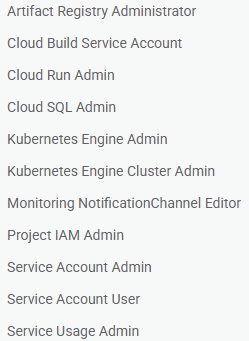

### What
GCP에서 디스코드 훅에 알람을 보내기 위한 미니 express 프로젝트입니다.

### GCP 셋업
**APIs**<br>
- apis & services에서 다음을 enable
- cloudbuild api
- cloud run admin api
- cloud resource manager api
- kubernetes engine api
<br>

**SA Permissions**<br>
- iam & admin에서 SA에 다음 role 추가


### Usage

1. 토큰 생성
`openssl rand -hex 32`

2. 프로젝트 폴더에서 Cloud Run으로 훅 백엔드 배포
```bash
gcloud run deploy gcp-alert-hook \
  --source . \
  --region asia-northeast3 \
  --allow-unauthenticated \
  --set-env-vars DISCORD_WEBHOOK=[디스코드웹훅url],ALERT_SECRET=[토큰] \
  --project [project-id]
```

3. Cloud Run instance 주소 찾기
`gcloud run services describe gcp-alert-hook --project [project-id] | grep URL:`
-> 6 선택
-> 출력된 URL을 webhook.json의 url 부분에 넣기

4. 이건 루트가 해야함 
```bash
gcloud beta run services add-iam-policy-binding --region=asia-northeast3 --member=allUsers --role=roles/run.invoker gcp-alert-hook --project [project-id]
```

5. webhook.json 스펙으로 monitoring channel 추가 
(created, destroyed 두개 엔드포인트 만들어야합니다 webhook.json [백엔드/라우트] 부분 및 이름 바꿔가면서 실행)
```bash
gcloud alpha monitoring channels create --channel-content-from-file="webhook.json" --project [project-id]
```

4. 콘솔에 logs explorer 검색 -> 쿼리에 다음을 입력
```plaintext
resource.type="gke_cluster"
protoPayload.methodName="google.container.v1.ClusterManager.CreateCluster"
protoPayload.response.status="RUNNING"
```
Run Query 눌러 본 후, 그래프 오른쪽 아래의 Actions 클릭 -> Create metric<br>
-> 이름만 수정 후 생성

5. delete 메트릭도 똑같이 생성
```plaintext
resource.type="gke_cluster"
protoPayload.methodName="google.container.v1.ClusterManager.DeleteCluster"
```

6. monitoring 콘솔에서 다음 작업을 create, delete 각각에 대해 반복<br>
-> alerting 탭 -> Add alert condition -> Select a metric -> Active 태그 비활성<br>
-> 생성한 메트릭 이름 검색 후 추가<br>
-> 필터 -> log 선택, comparator = -> cloudaudit.googleapis.com/activity<br>
-> Transform data에서 rolling window 30 min,<br>
-> rolling window function: count 선택 -> configure trigger로 이동<br>
-> threshold -> any time series + above threshold + 0 선택 -> Notifications로 이동<br>
-> Use notification channel 토글 후 Notification channel에서 아까 만든 채널 찾기<br>
-> 채널 옆에 edit(연필모양) 선택 -> url 끝에 쿼리 스트링 추가 (?auth_token=[토큰])<br>
-> Alert policy 이름 정한 후 create<br>
